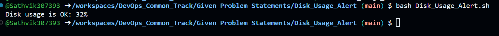

# Shell Scripting on Disk Usage

## 1. Setting up a threshold

For example over here I have set the threshold value to 20 as the Disk is not being used more than 32%
This threshold value helps us in evaluating whether the DISK is on HIGH USAGE or NORMAL USAGE

## 2. Fetching exact disk usage at present

Here the usage variable created fetches the present utilization of the disk and stores the value which
will be later on used for checking if the usage is HIGH or MINIMAL

