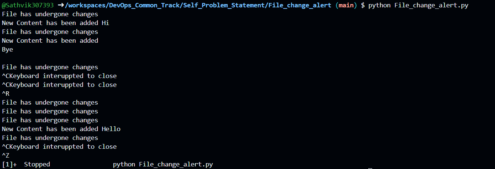
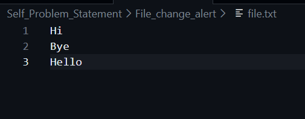

# Self Problem Statement

## Monitoring the changes taking place in a text file and also presenting the updated words or characters

1. Reading the file using with open and read mode

2. Setting the seek to 0 at the beginning so that it can even check for changes taking place from the first of the text page

### This is the terminal output

### This is the text file output
